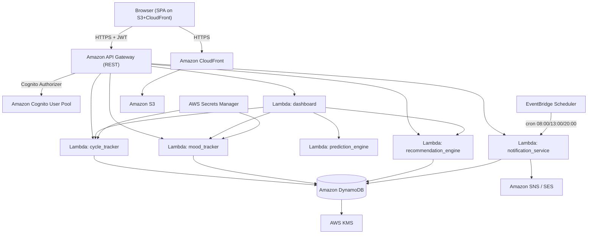
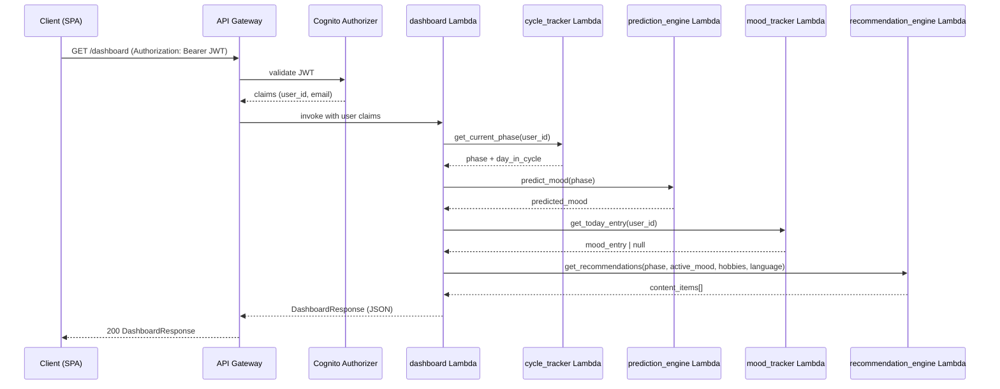

# Design Document: CycleSync

## Overview

CycleSync is a web application that helps women track their menstrual cycle phases, log daily moods, receive mood predictions, and get personalized content recommendations (songs, movies, poetry, digital colouring) based on their current phase, emotional state, and preferred language.

The system is built on AWS serverless infrastructure. Each domain concern (auth, cycle tracking, mood, recommendations, notifications) is implemented as a Python Lambda function exposed via API Gateway. User data is stored in DynamoDB with sensitive fields encrypted via AWS KMS. The frontend is a plain HTML/CSS/JavaScript SPA hosted on S3 + CloudFront.

Key design goals:
- Dashboard renders in under 2 seconds for 100 concurrent users
- All health data encrypted at rest via KMS; all traffic over HTTPS via CloudFront/API Gateway
- Phase calculation is deterministic and stateless -- pure Python function in Lambda
- Recommendations are computed on-demand from a tagged DynamoDB content library
- Amazon Cognito handles all authentication, JWT token issuance, and session management

---

## Architecture



API Gateway uses a Cognito User Pool Authorizer on all protected routes. The frontend SPA stores the Cognito JWT (ID token) in memory and sends it as a Bearer token on every API call.

### Request Flow for Dashboard Load



---

## Components and Interfaces

### Amazon Cognito (Auth_Service replacement)

Cognito User Pool handles all registration, login, JWT issuance, and password management. No custom auth Lambda is needed for the core auth flow.

```
POST /auth/register                → Cognito SignUp API (email, password, custom attributes)
POST /auth/login                   → Cognito InitiateAuth (USER_PASSWORD_AUTH flow) -> returns JWT tokens
POST /auth/logout                  → Cognito GlobalSignOut (invalidates refresh token)
POST /auth/forgot-password         → Cognito ForgotPassword API (sends verification code to email)
POST /auth/confirm-forgot-password → Cognito ConfirmForgotPassword API (verifies code + sets new password)
```

- Passwords are hashed and managed entirely by Cognito (bcrypt-equivalent internally)
- JWT ID tokens expire after 30 minutes; refresh tokens allow silent re-auth
- Custom user attributes stored in Cognito: `display_name`, `age`, `last_period_date`, `cycle_length_days`, `hobby_preferences`, `notifications_on`, `language_preference`
- API Gateway Cognito Authorizer validates JWT on every protected request and injects `sub` (user UUID) into the Lambda event context

**Forgot Password Flow:**
- `POST /auth/forgot-password`: accepts `{ email }`, calls Cognito `forgot_password(Username=email)`. Always returns a generic 200 response ("If this email is registered, you will receive a reset code") to avoid email enumeration.
- `POST /auth/confirm-forgot-password`: accepts `{ email, code, new_password }`, calls Cognito `confirm_forgot_password`. Returns 200 on success; frontend redirects to login with success message. Returns 400 on `CodeMismatchException` or `ExpiredCodeException`.
- Both endpoints are unauthenticated (no Cognito Authorizer required).

**Frontend screens for forgot password:**
- Forgot password screen: single email input + "Send Reset Code" button.
- Reset password screen: verification code input + new password input (min 8 chars) + confirm password input.

Profile and hobby endpoints are backed by a thin Lambda that reads/writes the `cyclesync-users` DynamoDB table:

```
GET  /profile              -> returns user profile from DynamoDB
PUT  /profile              -> updates profile attributes in DynamoDB (including language_preference)
PUT  /profile/hobbies      -> updates hobby_preferences in DynamoDB
```

### cycle_tracker Lambda (Python 3.12)

Stateless phase calculation. Reads `last_period_date` and `cycle_length_days` from `cyclesync-users` table.

```
GET /cycle/phase           -> returns { phase, day_in_cycle }
```

Phase mapping:
- Days 1-5: Period
- Days 6-13: Follicular
- Days 14-16: Ovulation
- Days 17-end: Luteal/PMS

### mood_tracker Lambda (Python 3.12)

```
POST /mood                 -> PutItem (upsert) on cyclesync-mood-entries
GET  /mood/history         -> Query by user_id, last 30 days, descending sort
GET  /mood/today           -> GetItem for today's date or null
```

Mood notes are encrypted client-side before storage using a KMS data key (envelope encryption via boto3 `encrypt`/`decrypt`).

### prediction_engine Lambda (Python 3.12)

Pure function, no DynamoDB access. Maps phase to predicted mood. Invoked directly by the dashboard Lambda (not exposed via API Gateway).

```
Period     -> Sad
Follicular -> Happy
Ovulation  -> Happy
Luteal/PMS -> Angry
```

### recommendation_engine Lambda (Python 3.12)

```
GET /recommendations       -> returns up to 5 items per hobby category
```

Selection logic:
1. Query `cyclesync-content-items` GSI on `mood_tags` matching active mood, filter by `category` in user hobbies, `language = user.language_preference`, and `is_deleted = false`
2. If results < 5 per category, fall back to items with `language = "en"` (English) matching the same mood/category filters
3. If still < 5, fall back to top-rated items in that category regardless of language (scan with filter)
4. Return at most 5 per category

### Content_Store admin endpoints (recommendation_engine Lambda)

```
GET    /admin/content      -> Scan cyclesync-content-items (paginated via LastEvaluatedKey)
POST   /admin/content      -> PutItem with generated UUID item_id
PUT    /admin/content/:id  -> UpdateItem by item_id
DELETE /admin/content/:id  -> UpdateItem set is_deleted = true (soft-delete)
```

Validation: description <= 80 chars, rating 1.0-5.0, category in {"Song","Movie","Poem","Digital Colouring"}, language is a non-empty BCP 47 code string.

### notification_service Lambda (Python 3.12)

Triggered by EventBridge Scheduler at 08:00, 13:00, and 20:00 UTC (configurable per user timezone in future). On each invocation:
1. Scan `cyclesync-users` for users with `notifications_on = true`
2. Check `cyclesync-notification-logs` -- skip users who already received 3 notifications today
3. Compute phase and select a random personality-driven message from the phase-appropriate pool in `NOTIFICATION_MESSAGES`
4. Publish via Amazon SNS (push) or SES (email)
5. Write a record to `cyclesync-notification-logs`

```
GET /notifications/settings -> returns user notification preferences from DynamoDB
PUT /notifications/settings -> UpdateItem on cyclesync-users
```

### dashboard Lambda (Python 3.12)

Single endpoint that orchestrates all service Lambdas via direct invocation (boto3 `lambda.invoke`):

```
GET /dashboard             -> DashboardResponse
```

Response shape:
```json
{
  "phase": "Follicular",
  "day_in_cycle": 8,
  "phase_message": "...",
  "support_message": "...",
  "predicted_mood": "Happy",
  "logged_mood": null,
  "active_mood": "Happy",
  "recommendations": {
    "Songs": [],
    "Movies": [],
    "Poetry": [],
    "Digital Colouring": []
  }
}
```

---

## Data Models

### cyclesync-users (DynamoDB)

| Attribute           | Type   | Notes                                                        |
|---------------------|--------|--------------------------------------------------------------|
| user_id (PK)        | String | UUID, matches Cognito `sub`                                  |
| email               | String | GSI partition key (`email-index`)                            |
| display_name        | String |                                                              |
| age                 | Number |                                                              |
| last_period_date    | String | YYYY-MM-DD, KMS-encrypted at rest                            |
| cycle_length_days   | Number | 21-45, default 28                                            |
| hobby_preferences   | List   | subset of ["Songs", "Movies", "Poetry", "Digital Colouring"] |
| language_preference | String | BCP 47 code, e.g. "en", "hi", "ta", "es"; default "en"      |
| notifications_on    | Bool   | default true                                                 |
| created_at          | String | ISO 8601                                                     |
| updated_at          | String | ISO 8601                                                     |

GSI: `email-index` -- partition key `email`

### cyclesync-sessions (DynamoDB) -- optional if using Cognito tokens directly

| Attribute    | Type   | Notes                                          |
|--------------|--------|------------------------------------------------|
| token (PK)   | String | Cognito refresh token or opaque string         |
| user_id      | String |                                                |
| expires_at   | String | ISO 8601; TTL attribute for auto-expiry        |
| ttl          | Number | Unix epoch seconds (DynamoDB TTL attribute)    |

> Note: With Cognito JWT tokens (30-min expiry) this table may be omitted entirely. It is retained for audit/revocation use cases.

### cyclesync-mood-entries (DynamoDB)

| Attribute       | Type   | Notes                                          |
|-----------------|--------|------------------------------------------------|
| user_id (PK)    | String | UUID                                           |
| entry_date (SK) | String | YYYY-MM-DD                                     |
| mood            | String | Happy / Sad / Angry                            |
| note            | String | max 500 chars, KMS-encrypted at rest           |
| created_at      | String | ISO 8601                                       |
| updated_at      | String | ISO 8601                                       |

Upsert via `PutItem` (replaces existing item with same PK+SK) or `UpdateItem`.

### cyclesync-content-items (DynamoDB)

| Attribute    | Type   | Notes                                                              |
|--------------|--------|--------------------------------------------------------------------|
| item_id (PK) | String | UUID                                                               |
| title        | String |                                                                    |
| category     | String | Song / Movie / Poem / Digital Colouring; GSI partition key         |
| mood_tags    | List   | subset of ["Happy", "Sad", "Angry"]; GSI PK                        |
| description  | String | max 80 chars                                                       |
| rating       | Number | 1.0-5.0                                                            |
| language     | String | BCP 47 code, e.g. "en", "hi", "ta", "es"                          |
| is_deleted   | Bool   | false = active; true = soft-deleted                                |
| created_at   | String | ISO 8601                                                           |

GSIs:
- `category-index` -- partition key `category`
- `mood-tags-index` -- partition key `mood_tags` (requires flattening or filter expression)
- `language-index` -- partition key `language` (supports language-filtered queries)

### cyclesync-notification-logs (DynamoDB)

| Attribute    | Type   | Notes                                          |
|--------------|--------|------------------------------------------------|
| user_id (PK) | String | UUID                                           |
| sent_at (SK) | String | ISO 8601 timestamp                             |
| slot         | String | morning / afternoon / evening                  |
| message      | String |                                                |

---

### Notification Message Library

Messages are hardcoded in the `notification_service` Lambda as a Python dict (no DynamoDB table needed for MVP). This keeps latency low and avoids a table scan on every notification invocation. If the library grows beyond ~50 messages, migrate to a `cyclesync-notification-messages` DynamoDB table with `phase` as the partition key and `message_id` as the sort key.

**Structure (Python dict):**

```python
NOTIFICATION_MESSAGES = {
    "Period": [
        "Your uterus is doing its thing and honestly? Respect the process.",
        "Today's agenda: heating pad, comfort food, zero obligations. You've earned it.",
        "Slow day. Soft music + rest = perfect combo 🎶",
    ],
    "Luteal/PMS": [
        "If you cried at an ad today... completely normal. You're not dramatic. You're hormonal.",
        "Warning ⚠️ Mood swings detected. Maybe skip arguments today 😜",
        "You're not angry... just hormonally powerful 💅",
    ],
    "Ovulation": [
        "This is your main character moment. Ask for that raise. TODAY.",
        "You're glowing today ✨ Perfect day to try something fun!",
        "High energy mode ON 🚀 Go conquer the day!",
    ],
    "Follicular": [
        "New cycle, new energy. What are you going to do with all this clarity? 🌱",
        "Your brain is basically a supercomputer right now. Use it.",
        "Fresh start energy activated ✨",
    ],
}
```

The `notification_service` Lambda selects a random message from the phase-appropriate pool using `random.choice(NOTIFICATION_MESSAGES[phase])` on each invocation.

---

## Correctness Properties

*A property is a characteristic or behavior that should hold true across all valid executions of a system -- essentially, a formal statement about what the system should do. Properties serve as the bridge between human-readable specifications and machine-verifiable correctness guarantees.*

### Property 1: Registration rejects missing required fields

*For any* registration request missing one or more required fields (email, password, display name, age, last period date, cycle length), the Auth_Service should return a validation error and no user account should be created.

**Validates: Requirements 1.1**

---

### Property 2: Registration round-trip

*For any* valid registration payload (unique email, password >= 8 chars, all required fields present), submitting it should result in a new user existing in the system and a valid session token being returned.

**Validates: Requirements 1.2**

---

### Property 3: Password minimum length enforcement

*For any* password string shorter than 8 characters, the Auth_Service should reject the registration and return an error. For any password of 8 or more characters, length alone should not cause rejection.

**Validates: Requirements 1.4**

---

### Property 4: Passwords are never stored in plaintext

*For any* registered user, the value stored for the password should not equal the original plaintext password string (Cognito never exposes the hash; the plaintext must not appear in DynamoDB or logs).

**Validates: Requirements 1.5**

---

### Property 5: Login round-trip

*For any* registered user, submitting their correct email and password should return a valid JWT token that can be used to access protected endpoints.

**Validates: Requirements 2.1**

---

### Property 6: Session expiry after inactivity

*For any* JWT ID token, after 30 minutes the token should be rejected as invalid by the Cognito Authorizer on the next request.

**Validates: Requirements 2.3**

---

### Property 7: Logout invalidates session

*For any* active session, after the user calls GlobalSignOut, the refresh token should be rejected as invalid on any subsequent token-refresh attempt.

**Validates: Requirements 2.4**

---

### Property 8: Profile update round-trip

*For any* valid profile update payload (name, age, last period date, cycle length in range), saving it should result in the updated values being returned on the next profile fetch.

**Validates: Requirements 3.1**

---

### Property 9: Cycle length validation

*For any* cycle length value outside the range [21, 45], the profile Lambda should return a validation error. For any value within [21, 45], it should be accepted.

**Validates: Requirements 3.3**

---

### Property 10: Phase calculation correctness

*For any* last period date and cycle length in [21, 45], the computed `day_in_cycle = (today - last_period_date) mod cycle_length` should fall in [1, cycle_length], and the resulting phase should match the defined day-range mapping (1-5: Period, 6-13: Follicular, 14-16: Ovulation, 17-end: Luteal/PMS).

**Validates: Requirements 4.1, 4.2**

---

### Property 11: Mood note length enforcement

*For any* mood entry note longer than 500 characters, the mood_tracker Lambda should reject the submission. For any note of 500 characters or fewer, length alone should not cause rejection.

**Validates: Requirements 5.2**

---

### Property 12: Mood entry persistence round-trip

*For any* valid mood entry (mood value + optional note), after submission the entry should be retrievable from DynamoDB with the same mood value, note, and a timestamp.

**Validates: Requirements 5.3**

---

### Property 13: One mood entry per day (upsert invariant)

*For any* user and any number of mood submissions on the same calendar day, querying that day's entry should return exactly one record reflecting the most recent submission.

**Validates: Requirements 5.4, 5.5**

---

### Property 14: Mood history ordering and window

*For any* user's mood history response, all entries should have dates within the last 30 calendar days and the list should be sorted in descending date order.

**Validates: Requirements 5.6**

---

### Property 15: Phase-to-mood prediction mapping

*For any* cycle phase value in {Period, Follicular, Ovulation, Luteal/PMS}, the prediction_engine Lambda should return the defined predicted mood (Period: Sad, Follicular: Happy, Ovulation: Happy, Luteal/PMS: Angry).

**Validates: Requirements 6.1**

---

### Property 16: Phase explanatory message length

*For any* cycle phase, the explanatory message included in the dashboard response should be no more than 100 characters.

**Validates: Requirements 6.3**

---

### Property 17: Logged mood takes priority on dashboard

*For any* user who has logged a mood entry for today, the dashboard response should return the logged mood as `active_mood` and the predicted mood as a secondary field, not as the primary.

**Validates: Requirements 6.4**

---

### Property 18: Hobby preference persistence round-trip

*For any* non-empty subset of {Songs, Movies, Poetry, Digital Colouring}, saving it as hobby preferences should result in the same set being returned on the next profile fetch from DynamoDB. Similarly, saving a Language_Preference code should return the same code on the next fetch.

**Validates: Requirements 7.3, 7.4, 7.7**

---

### Property 19: Recommendation correctness

*For any* active mood and set of hobby preferences, every content item returned by the recommendation_engine Lambda should have a mood tag matching the active mood and a category matching one of the user's selected hobbies. The count per category should be at most 5.

**Validates: Requirements 8.1, 8.2**

---

### Property 20: Content item validity invariant

*For any* content item stored in `cyclesync-content-items`, its description should be no more than 80 characters, its rating should be between 1.0 and 5.0, its category should be one of {Song, Movie, Poem, Digital Colouring}, and its language should be a non-empty string.

**Validates: Requirements 8.7, 10.1**

---

### Property 21: Content CRUD round-trip

*For any* valid content item, creating it via `POST /admin/content` and then reading it by `item_id` should return an equivalent item with all fields intact.

**Validates: Requirements 10.2**

---

### Property 22: Deleted content excluded from recommendations

*For any* content item that has been soft-deleted (`is_deleted = true`), it should not appear in any recommendation result returned after the deletion.

**Validates: Requirements 10.3**

---

### Property 23: Phase support message length

*For any* cycle phase, the personalized emotional support message on the dashboard should be no more than 150 characters.

**Validates: Requirements 9.2**

---

### Property 24: Unauthenticated access to another user's data is rejected

*For any* two distinct users A and B, using user A's JWT token to request user B's profile, mood history, or dashboard data should return an authorization error (403), not user B's data.

**Validates: Requirements 12.4**

---

### Property 25: Forgot password email enumeration prevention

*For any* email address (registered or not), the `POST /auth/forgot-password` endpoint should always return the same generic 200 response body, making it impossible to determine whether the email is registered.

**Validates: Requirements 2b.3**

---

### Property 26: Language preference filtering

*For any* user with a Language_Preference set to a non-English code, if content items exist for that language matching the active mood and hobby, the recommendation results should contain only items with that language code (not English items). If no items exist for that language, results should fall back to English items.

**Validates: Requirements 8.3, 8.4**

---

## Error Handling

### Validation Errors (400)
- Missing required fields on registration or profile update
- Password shorter than 8 characters (enforced by Cognito password policy)
- Cycle length outside [21, 45]
- Mood note exceeding 500 characters
- Invalid mood value (not Happy/Sad/Angry)
- Content item description exceeding 80 characters or rating outside [1, 5]
- Invalid or expired verification code on confirm-forgot-password

All 400 responses return a JSON body: `{ "error": "field_name", "message": "human-readable description" }`

### Authentication Errors (401)
- Missing or expired JWT on any protected endpoint (rejected by Cognito Authorizer)
- Invalid credentials on login (Cognito `NotAuthorizedException`)
- Invalid or expired verification code on confirm-forgot-password (Cognito `CodeMismatchException`, `ExpiredCodeException`)

Response: `{ "error": "unauthorized", "message": "..." }`

### Authorization Errors (403)
- Attempting to access another user's resources (Lambda checks `sub` claim vs resource owner)
- Non-admin attempting to access `/admin/*` endpoints

### Conflict Errors (409)
- Registering with an already-used email address (Cognito `UsernameExistsException`)

### Not Found (404)
- Content item `item_id` does not exist on update/delete

### Graceful Degradation
- If recommendation_engine finds no matching content in the user's preferred language, it falls back to English items, then to top-rated items
- If cycle_tracker cannot compute a phase (missing profile data), the dashboard returns a partial response with a prompt to complete the profile rather than an error
- If notification_service fails to publish via SNS/SES, the failure is logged to CloudWatch and retried at the next scheduled slot; it does not affect the main request path

---

## Testing Strategy

### Dual Testing Approach

Both unit tests and property-based tests are required. They are complementary:
- Unit tests cover specific examples, integration points, and edge cases
- Property tests verify universal correctness across randomized inputs

### Property-Based Testing

Use **Hypothesis** (Python) for all property-based tests. Each property test must run a minimum of 100 examples (`@settings(max_examples=100)`).

Each property test must be tagged with a comment in this format:
```python
# Feature: cycle-sync, Property N: <property_text>
```

One property-based test per correctness property defined above.

Key Hypothesis strategies needed:
- `valid_user_strategy` -- `st.fixed_dictionaries` with email, password >= 8 chars, cycle length 21-45, valid date, language code
- `mood_entry_strategy` -- `st.sampled_from(["Happy","Sad","Angry"])` + `st.text(max_size=500)` for note
- `content_item_strategy` -- random item with valid category (Song/Movie/Poem/Digital Colouring), mood tags, description <= 80 chars, rating 1.0-5.0, language code
- `phase_strategy` -- `st.sampled_from(["Period","Follicular","Ovulation","Luteal/PMS"])`
- `cycle_day_strategy(cycle_length)` -- `st.integers(min_value=1, max_value=cycle_length)`
- `language_strategy` -- `st.sampled_from(["en","hi","ta","es"])`

Edge cases to include in strategies:
- Empty note string (valid)
- Note exactly 500 characters (boundary)
- Cycle length exactly 21 and exactly 45 (boundaries)
- Password exactly 8 characters (boundary)
- User with no hobby preferences (default to all four)
- Content store with no items matching a mood (triggers fallback)
- Content store with items only in English when user prefers another language (triggers language fallback)

### Unit Tests

Focus on:
- Specific phase calculation examples (e.g., day 1: Period, day 14: Ovulation, day 17: Luteal/PMS)
- Login with wrong password returns generic error (not field-specific)
- Dashboard response structure when user has no mood logged today
- Dashboard response structure when user has logged a mood today
- Recommendation fallback when no content matches user language (falls back to English)
- Recommendation fallback when no content matches at all (falls back to top-rated)
- JWT expiry boundary (29 min 59 sec = valid, 30 min 1 sec = invalid)
- Admin soft-delete immediately removes item from recommendation results
- forgot-password always returns same response regardless of email existence
- Notification message selection returns a message from the correct phase pool

### Integration Tests

- Full registration -> login -> dashboard flow (using Cognito local mock or moto)
- Mood submission -> history retrieval
- Profile update -> phase recalculation reflected on dashboard
- Content item create -> appears in recommendations -> soft-delete -> no longer appears
- Forgot password flow: request code -> confirm with valid code -> login with new password

### Performance Targets

- Dashboard endpoint: p95 response time < 2 seconds under 100 concurrent users
- Phase calculation: < 500ms (pure computation, should be < 1ms in practice)
- Recommendation query: < 500ms with DynamoDB GSI on category and mood_tags
